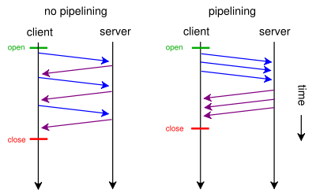

# HTTP1.1的管道技术(HTTP pipelining)

## pipelining技术概述

HTTP管线化（英语：HTTP pipelining）是将多个HTTP请求（request）整批提交的技术，而在发送过程中不需先等待服务器的回应。

## 缺点
仍然需要按照客户端的请求顺序响应，线头阻塞（HOL blocking）可能发生，造成延迟。且只有 `GET` 和 `HEAD` 等要求可以进行管线化，非幂等的方法，例如POST将不会被管线化。

## 现状
目前大部分桌面浏览器都关闭了这个特性。