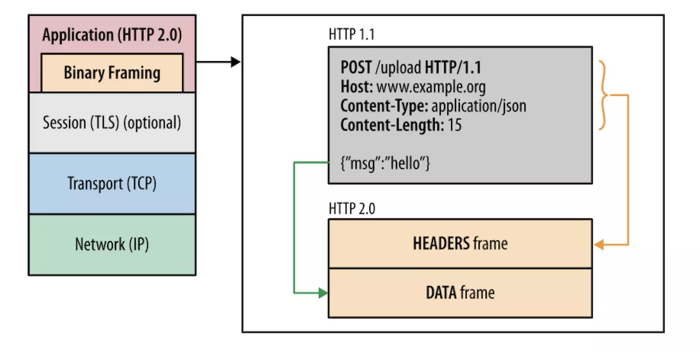
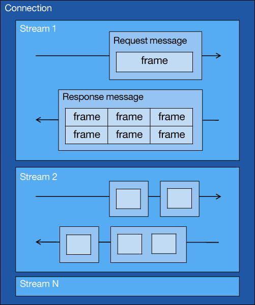
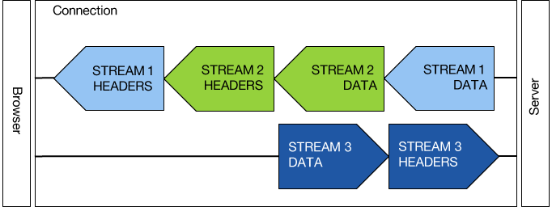
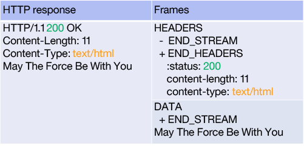
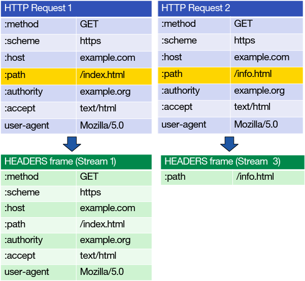

# HTTP/2

## 概述

`HTTP/2`作为二进制协议（HTTP1 是基于文本的协议）首要目标是为了改善 WEB 应用的用户体验。保留了原始 HTTP 协议语义，更改了系统之间传输数据的方式（主要在服务端和客户端处理）。

## 历史问题

- 线头阻塞

  HTTP 1.0 仅允许通过一个 TCP 连接发出一个请求。这引发了所谓的 “线头阻塞” 问题，迫使浏览器等待缓慢的响应。HTTP 1.1 通过[管道](./http1.1中的管道技术.md)解决了这个问题，管道使浏览器能并行发出多个请求。但是，浏览器供应商很难实现管道，而且大多数浏览器（包括 Firefox）在发布时都会默认禁用该特性。Chrome 甚至完全删除了它。

- TCP 连接数量

  每个主机最多可以打开 2 个 TCP 连接。由于这一特性，开发人员通过使用一种称为域分片（domain sharding）的流行技术，开发人员能创建多个主机，每个主机提供一个网站所需资源的一部分。切分已变得非常普遍，网页加载期间打开的平均 TCP 连接数量也因此达到约 35 个。

  同时浏览器也逐渐放开连 TCP 连接的最大数量，例如 Chrome 就开放至 24 个。

- 资源内联和级联

  文件串联：合并文件（超级大 bundle）为网站的所有 CSS 创建一个文件，为 JavaScript 创建一个文件  
  资源内联：合并资源（例如图像转 base64 码）

  缺点显而易见，无法有效缓存和增加解析成本。

## 新特性

#### 1. 新升级路径（不是强制规定）

HTTP/2 升级路径与标准路径稍有不同，省去了一些协商。对于基于 HTTP/2 的安全连接，无法通过升级标头请求切换协议。通过应用层协议 ALPN 的新拓展，客户端会想服务器告知它能理解的协议（按偏好排序），服务选择第一个作为响应。

#### 2. 二进制协议（二进制分帧层）

最核心的改变，取决于它重新设计了编码机制，而没有修改方法、动词和标头的熟悉语义。

最重要的是，所有通信都在单个 TCP 连接上执行，而且该连接在整个对话期间一直处于打开状态。这可能得益于二进制协议将通信分解为帧的方式：这些帧交织在客户端与服务器之间的双向逻辑流中。

- 连接的拓扑结构

在 HTTP/2 中仅在客户端与服务器之间建立一个 TCP 连接，该连接在交互持续期间一直处于打开状态。在此连接上，消息是通过逻辑流进行传递的。一条消息包含一个完整的帧序列。在经过整理后，这些帧表示一个响应或请求。

- 连接和流

  一个对等节点创立一个连接，一个连接上会传输多个流。因为流可以交织，所以可以同时快速传输多个流。

- 消息

  有一个或多个帧组成，在对等节点重建后形成一个完整的请求和响应。特定消息的帧在同一个流上发送，这意味着一个请求或响应只能映射到一个可识别的流。

- 帧  
  帧是通信的基本单位。每个帧有一个标头，其中包含帧的长度和类型、一些布尔标志、一个保留位和一个流标识符，如图 3 所示。

  

  名词解释：

  - length：默认 2^14 个字节（16kb），可以协商调整至 2^24 个字节（16MB）
  - type：标识帧的[用途](https://tools.ietf.org/html/rfc7540#section-11.2)（10 种）
  - flag：指定帧的状态信息
  - stream identifier： 用于跟踪逻辑流的帧成员关系。成员每次仅属于一条消息和流。流可以提供优先级建议

#### 3. 请求/响应复用

将消息分解为帧，为每帧分配一个流标识符，然后在一个 TCP 连接上独立发送它们。此技术实现了完全双向的请求和响应消息复用。这也解决了线头阻塞的问题。

上图：交织在一起的帧

帧交织在一起的好处：

- 所有请求和响应都在一个套接字上发生。
- 所有响应或请求都无法相互阻塞。
- 减少了延迟。
- 提高了页面加载速度。
- 消除了对 HTTP 1.1 工具的需求。

在 HEADERS 帧中，设置了两个标志。第一个是 END_STREAM，它设置为 true（由加号表示），表明该帧是给定请求的最后一帧。END_HEADERS 标志也设置为 true，表明该帧是流中最后一个包含标头信息的帧。

在 HEADERS 帧中，END_STREAM 表明该帧不是流中的最后一帧，而 END_HEADER 表明它是最后一个包含标头信息的帧。在 DATA 帧中，END_STREAM 表明它是最后一帧。

#### 4.报头压缩

HTTP/2 协议拥有配套的 HPACK。客户端和服务器都维护之前看见的标头字段的列表（动态字典）。未来在构建引用了已看见标头列表的消息时可以使用此列表（传输字典索引）。

如果两个请求只有:path 部分不同，在第一个请求后，它仅需发送与前一个标头的不同之处，因为服务器保留着以前看见的标头的列表。除非设置了标头值，否则会假设后续请求拥有与之前的请求相同的标头值。

#### 5.流优先级

消息帧通过流进行发送。每个流都分配了一个优先级，用于确定它的处理顺序，以及它将收到的资源量。

将该优先级输入到给定流的标头帧或优先级帧中，优先级可以是 0 到 256 之间的任何数字。同时也可以定义依赖关系

#### 6.服务器推送

服务器推送使服务器能预测客户端请求的资源需求。然后，在完成请求处理之前，它可以将这些资源发送到客户端。可利用来做客户端缓存，但如何控制是一个问题。

#### 7.流控制

允许接收者停止或减少发送的数据量。例如观看一个视频流时，服务器正在向客户端发送数据。如果视频暂停，客户端会通知服务器停止发送视频数据，以避免耗尽它的缓存。

## 后记

借助 HTTP/2 您不再需要串联文件，将图标整理到一个图像中，设置大量域，或者内联资源。同时可以利用服务器推送进行合理的客户端资源缓存。
