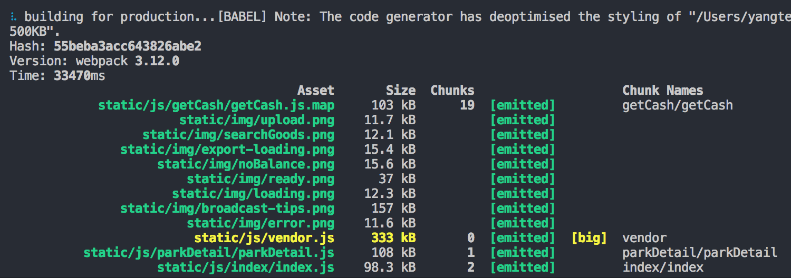
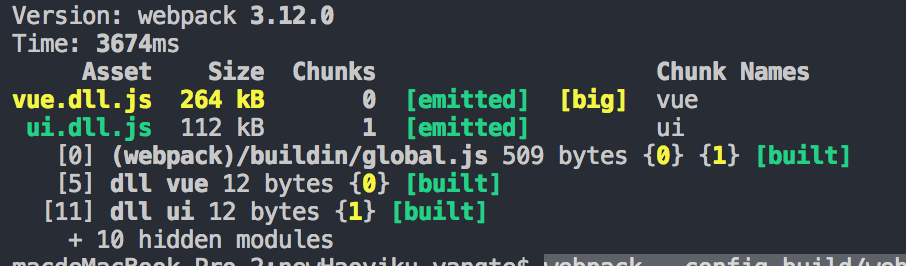

最近接手一个项目，更改过后的build时间需要17s，作为心急的我无法忍受，马上上手进行webpack优化，在敲这篇文字的时候我还不知道能优化到什么程度，所以算是一个直播过程吧。  

### 先分析一下影响打包的速度的主要因素是什么？
文件多？  
依赖？  
页面？（手上的项目20来个）  
使用loader的方式、范围  
编译方式  
……  

### 打包优化的方法  
1. 分开vendor和app   
由于开发过程中主要是在修改业务代码，第三方代码修改较少，所以我们可以分开vendor和app  
所以这边我采用的是 DLLPlugin 和 DLLReferencePlugin  
#### 原理（网上查的）：  
如何解决业务代码对第三方的依赖？  
DLLPlugin 和 DLLReferencePlugin 协同作用，通过打包第三方文件会产生一个映射关系（Map），这个映射会在打包业务代码的时候被引用，所以在代码中引用第三方库的时候其实就是在告诉webpack这是第三方库，不用进行打包（已经打包过了）  
2. UglifyJsPlugin的并行处理，压榨机器性能  
传参 
parallel  
cache  
3. HappyPack 并行处理loader，HappyPack.ThreadPool共享文件之间的线程  
4. 减少babel-loader的处理时间  
开启缓存  options.cacheDirectory  
规定范围  include
         exclude
5. 其他  
减少resolve  
Devtool：去除sourcemap  
cache-loader  
升级node  
升级webpack  

### 开搞  
进行如下配置  
```
const path = require('path')
const webpack = require('webpack')

module.exports = {
    entry: {
        vue: ['vue', 'vue-router','vue-awesome-swiper', 'vue-lazyload', 'vue-swipe'],
        ui: ['aifocus-ui']
    },

    output: {
        path: path.join(__dirname, '../src/dll/'),
        filename: '[name].dll.js',
        library: '[name]'    //引用的时候使用第三方库的方式，使用全局变量就能拿到
    },

    plugins: [
        new webpack.DllPlugin({
            path: path.join(__dirname, './src/dll/', '[name]-manifest.json'),
            name: '[name]'
        }),

        new webpack.optimize.UglifyJsPlugin()
    ]
}
```
配置后命令行输入 webpack --config build/webpack.dll.conf.js   
